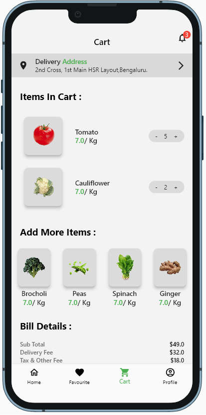
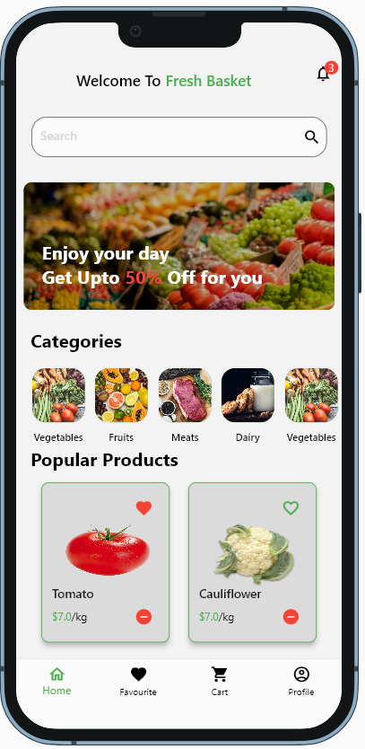
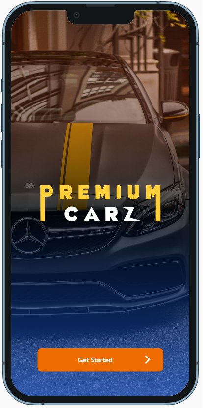
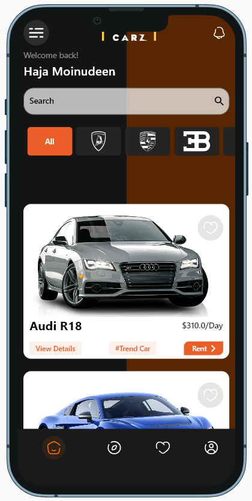
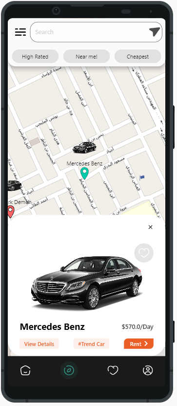
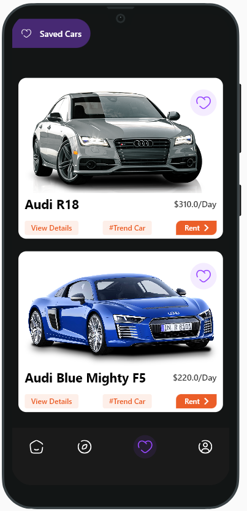
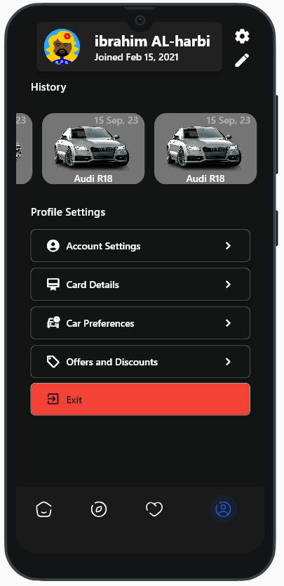

# flutter-playground

in this project there are multiple apps inside my app

# List of apps
### Fresh Basket
##### design source -> [figma](https://www.figma.com/community/file/1291725321690138984/fresh-baskets)
##### code path -> 
## photos
|  |   |
|--|--|
|  |  |

### Car Booking
##### design source -> [figma](https://www.figma.com/community/file/1291131202073146570/car-booking-app)
##### code path -> 
|  |   |
|--|--|
|  |  |
||

